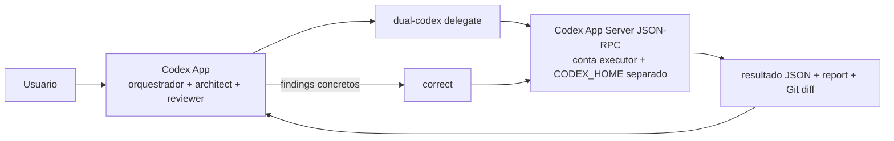

# Dual Codex Orchestrator — contas, roles e fluxo local

Orquestrador local para coordenar contas Codex autenticadas separadamente. Cada
conta possui seu proprio `CODEX_HOME`; os roles apenas dizem qual conta executa
cada parte do fluxo.

```text
Task → Architect plan → Executor implementation → Reviewer
                                  ↑                 |
                                  └── correction ───┘
```

O projeto nao faz commit, push, PR ou merge. Os artefatos ficam em `runs/` e o
repositorio pode exigir estado limpo por configuracao.

## Account profile != Role

Uma conta autenticada e uma coisa; o papel de orquestracao e outra:

```text
Account profile:
biel4 / CodexProfiles/executor / sessao autenticada

Role:
executor → biel4
```

Uma conta pode ter varios roles, e uma conta sem role continua registrada. O
role `reviewer` pode ficar sem atribuicao; nesse caso, a revisao usa a conta de
`architect`. Os roles `architect` e `executor` precisam estar atribuídos para
executar o fluxo.

## Requisitos e instalacao no Windows

- Windows 10 ou 11
- Python 3.11 ou superior
- Git
- Codex CLI instalado e disponivel no PowerShell, inclusive `codex.CMD`

```powershell
py -3.11 -m venv .venv
.\.venv\Scripts\Activate.ps1
python -m pip install -e .
Copy-Item config.example.toml config.toml
notepad config.toml
```

Em `config.toml`, ajuste `repository`, os caminhos `codex_home` e o comando do
Codex. O arquivo local e ignorado pelo Git. Nunca compartilhe `auth.json`.

## Registro de contas

As chaves em `[accounts.<name>]` sao identificadores locais estaveis. `label`
serve somente para exibicao; nao e usado para descobrir ou autenticar uma conta.

```toml
[accounts.primary]
label = "Primary account"
codex_home = "C:/Users/USER/CodexProfiles/architect"
model = ""
reasoning_effort = "high"

[accounts.secondary]
label = "Secondary account"
codex_home = "C:/Users/USER/CodexProfiles/executor"
model = ""
reasoning_effort = "high"

[roles]
orchestrator = "primary"
architect = "primary"
reviewer = "primary"
executor = "secondary"
```

O sandbox e definido pelo role: `architect`/`reviewer` usam `read-only` e
`executor` usa `workspace-write`. Trocar contas nao troca essas permissoes.

Para adicionar uma terceira conta, sem atribuir role automaticamente:

```powershell
dual-codex account add tertiary --label "Terceira conta"
```

O comando cria um `CODEX_HOME` separado, grava seu `config.toml` sem BOM,
executa o login somente nesse perfil e verifica o status depois. Tambem e
possivel informar `--codex-home`, `--model`, `--reasoning-effort` e repetir
`--role` para uma atribuicao explicita.

## Comandos CLI

```text
dual-codex account add [name] [--label LABEL] [--codex-home PATH]
dual-codex account login NAME [--yes]
dual-codex account list
dual-codex account rename OLD-NAME NEW-NAME
dual-codex account label NAME LABEL
dual-codex account remove NAME [--delete-profile] [--confirm-delete]

dual-codex role list
dual-codex role assign ROLE ACCOUNT
dual-codex role unassign ROLE
dual-codex role swap ROLE-A ROLE-B

dual-codex status [--json]
dual-codex dashboard [--port PORT] [--no-open]
dual-codex doctor
dual-codex run task.md
dual-codex delegate --request-file request.json --result-file result.json
```

Exemplos:

```powershell
# Ver todas as atribuicoes sem exibir credenciais
dual-codex status
dual-codex role list

# Mover o trabalho executor para outra conta
dual-codex role assign executor tertiary

# Trocar Architect e Executor
dual-codex role swap architect executor

# Alterar somente o nome amigavel, sem novo login
dual-codex account label tertiary "Conta de testes"
```

`account rename` atualiza as referencias de role sem mover o `CODEX_HOME`.
`account remove` exige que nenhum role use a conta e nao remove o diretorio por
padrao. Para apagar um perfil, use explicitamente `--delete-profile` e confirme
quando solicitado.

## Migracao do formato antigo

O formato antigo com `[architect]` e `[executor]` continua sendo lido para
manter o fluxo funcionando, mas deve ser migrado antes de alterar contas ou
roles. A migracao nao abre login e nao move, le ou regrava `auth.json`.

Primeiro use um dry run:

```powershell
dual-codex migrate-config `
  --architect-name biel3 `
  --executor-name biel4 `
  --architect-label "Conta Architect" `
  --executor-label "Conta Executor" `
  --dry-run
```

Se a pre-visualizacao estiver correta, repita sem `--dry-run`:

```powershell
dual-codex migrate-config --architect-name biel3 --executor-name biel4 `
  --architect-label "Conta Architect" --executor-label "Conta Executor"
```

A migracao cria um backup timestampado de `config.toml`, preserva exatamente os
caminhos existentes, cria:

```text
legacy Architect → orchestrator, architect, reviewer
legacy Executor  → executor
```

Ela aceita TOML com BOM, grava a nova configuracao sem BOM e e segura para
repetir: uma configuracao ja migrada nao e duplicada nem sobrescrita.

Para o layout local ja existente, informe os nomes desejados e mantenha os
diretorios:

```text
C:/Users/USER/CodexProfiles/architect
C:/Users/USER/CodexProfiles/executor
```

Esses caminhos sao apenas exemplos; nao sao hardcoded no aplicativo e devem ser
substituidos pelos perfis locais de cada maquina.

## Dashboard local de contas

`dual-codex dashboard` inicia o painel de controle em `127.0.0.1` e abre o
navegador; use `--no-open` para apenas imprimir a URL ou `--port` para fixar
uma porta. O painel consulta o App Server por processo/`CODEX_HOME` isolado e
mostra contas, roles, backend, login, modelos anunciados, reasoning, Fast ou
outro service tier, rate limits, uso e thread persistente quando disponíveis.

O campo `model = ""` significa **Inherit Codex default**. O modelo efetivo só
é exibido quando descoberto pelo catálogo/eventos instalados; nunca é inferido
como Sol ou qualquer outro valor. Alterações do painel são validadas e salvas
atomicamente para turnos futuros; a thread persistente atual não é alterada
silenciosamente. Métricas ou métodos não suportados aparecem como `Unknown` ou
`Not available`.

Os controles de reasoning e service tier/Fast acompanham imediatamente o
modelo selecionado e usam o modelo anunciado como default quando `model = ""`.
Opções incompatíveis são ajustadas no formulário com aviso, sem alterar a
configuração até `Save`. Cada conta também pode manter vários roles; o editor
por checkboxes aplica o conjunto completo em uma operação atômica e transfere
roles globais para a conta escolhida quando necessário.

## Status e seguranca

`dual-codex status` mostra contas, labels, caminhos abreviados, login, roles,
repositorio ativo, estado do Git, caminho/versao do Codex e configuracao atual.
Ele nao le `auth.json` para descobrir identidade e nao imprime tokens, conteudo
de autenticacao ou caminhos completos de credenciais.

O `doctor` verifica executavel, perfis, existencia de login, roles necessarios e
repositorio. O login de cada conta usa somente seu proprio `CODEX_HOME`.

## Testes

```powershell
python -m unittest discover -s tests -v
python -m compileall -q src
python -m pip install --no-deps -e .
```

Os testes usam diretorios temporarios e placeholders nao secretos. Nenhum teste
precisa de uma conta Codex real.

## Delegacao visivel pelo Codex App

O fluxo recomendado para uso diario deixa o Codex App como interface visivel:



Conta visivel: `Codex App -> orquestrador + architect + reviewer`
Conta oculta: `Codex CLI -> executor`

Use a frase natural `Use Dual Codex to implement this task.` no App. O App
inspeciona o repositorio alvo, prepara o pedido JSON, chama o launcher local,
aguarda `DUAL_CODEX_RESULT`, le o resultado, o report, o estado do Git e o
diff, e somente entao apresenta a conclusao. O usuario normalmente nao precisa
abrir o CLI nem criar `task.md`.

O comando principal e:

```powershell
.\scripts\dual-codex.ps1 --config .\config.toml delegate `
  --request-file .\request.json --result-file .\result.json
```

Tambem e possivel usar `--stdin` em vez de `--request-file`. O alvo deve ser
explicito em `repository` no pedido ou por `--repository`; a opcao de linha de
comando tem precedencia. Um repositorio sujo e recusado quando
`require_clean_git = true`; `--allow-dirty` e a excecao explicita.

O App pode consultar o estado sem expor autenticacao:

```powershell
.\scripts\dual-codex.ps1 --config .\config.toml status --json
```

## Transporte App Server e fallback TUI

O backend preferencial do executor nativo Windows e `app_server`: Dual Codex
inicia `codex app-server --stdio` com o `CODEX_HOME` isolado da conta, usa
JSON-RPC newline-delimited, mantem a associacao repositorio→thread e envia a
tarefa completa por `turn/start`. O ciclo de trabalho e dirigido por
`turn/started`/`turn/completed`, sem inferir idle ou atividade pela tela.
`approvalPolicy = "never"` e usado para o executor `workspace-write`; qualquer
pedido inesperado de aprovacao e recusado, nunca elevado para
`danger-full-access`. O processo permanece local em stdio, sem listener de
rede, e as chaves de API herdadas sao removidas do ambiente filho.

Configure por conta:

```toml
[accounts.secondary]
backend = "app_server"
```

O backend legado `windows` continua disponivel como `native_tui` para
diagnostico/fallback. Ele preserva ConPTY, `pty-host.js`, named pipe, readiness,
rollout scoping e os comandos `dual-codex terminal`.

## Terminais Windows persistentes

Para visibilidade e fallback TUI, Dual Codex usa ConPTY por meio de um host
Node pequeno (`node-pty`). O Python continua sendo o orquestrador. Cada conta
possui uma sessao independente, `CODEX_HOME`, repositorio, PID e log; o
controle entre Python e o host usa uma named pipe local, sem servidor de rede.
O host desativa a integracao opcional `apps` do CLI para nao depender do MCP
`codex_apps` do Desktop durante uma sessao local.

Instale a dependencia do host uma vez:

```powershell
npm install
```

Abra as duas sessoes visiveis em terminais nativos separados:

```powershell
dual-codex terminal start biel3 --role architect --attach
dual-codex terminal start biel4 --role executor --attach
```

Use `dual-codex terminal list`, `send`, `attach` e `terminate` para consultar,
enviar follow-ups, rever a saida e encerrar sessoes. O fluxo `delegate` reutiliza
a sessao persistente do executor para manter o contexto entre mensagens. O
fluxo legado `run` e o fallback para executaveis mockados ainda usam o caminho
one-shot por compatibilidade; o backend persistente nao usa `codex exec`.

No fluxo persistente, o ConPTY e apenas um canal interativo de controle. O corpo
de requests `implement`/`correct` fica em um artefato auditavel em
`runs/executor-task-artifacts`, com SHA-256, e o TUI recebe somente uma mensagem
curta para ler esse arquivo. Isso evita a representacao `[Pasted Content ...]`
do composer para tarefas longas; follow-ups curtos continuam inline e follow-ups
longos usam o mesmo transporte por arquivo. A mensagem de controle e sempre uma
linha; o texto e o Enter (`\r`) sao enviados separadamente.
A entrega tambem aguarda um marcador unico `[DC:...]` aparecer no composer
antes de enviar o Enter; esse acknowledgement tem timeout proprio e nao reenvia
o controle em caso de falha.

A deteccao de atividade tambem e escopada ao processo ConPTY atual: rollouts
historicos e inalterados sao registrados como stale e nao bloqueiam uma nova
readiness, enquanto rollouts criados/atualizados no epoch atual ou associados ao
mesmo `Codex session_id` continuam bloqueando corretamente.

Arquiteturalmente, a implementacao segue o padrao de runtime-process nativo do
Agent Orchestrator (processo por sessao e `node-pty`/ConPTY), o conceito de
Codex como terminal persistente do AWS CLI Agent Orchestrator e o monitoramento
de sessoes/follow-ups demonstrado pelo codex-orchestrator. Esses projetos sao
referencias, nao dependencias nem codigo incorporado.

WSL continua sendo o fallback secundario planejado; o runtime Windows nao usa `danger-full-access`,
`--dangerously-bypass-approvals-and-sandbox`, servidor de rede ou credenciais
compartilhadas.

Consulte [docs/CLI.md](docs/CLI.md), [docs/APP-INTEGRATION.md](docs/APP-INTEGRATION.md)
e [docs/TROUBLESHOOTING.md](docs/TROUBLESHOOTING.md) para os schemas, o fluxo
de correcoes e a recuperacao de falhas.
